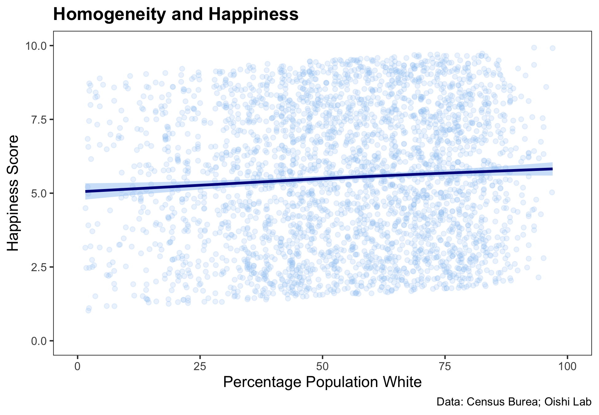

```{r setup, include = FALSE}
chooseCRANmirror(ind=65)
library(Require)
Require("stargazer")
library("papaja")
library(tidyverse)
library(psych)
library(stats)
library(lme4)
library(scales)
library(broom)
library(ggplot2)
library(readr)
library(tinytex)
Require("jtools")
r_refs("thesis-r-references.bib")
```

```{r analysis-preferences}
# Seed for random number generation
set.seed(42)
knitr::opts_chunk$set(cache.extra = knitr::rand_seed)
```

```{r loading_data, warning=FALSE}

Zip_Richness_Diversity <- read_csv("Edited_Richness_ZIP_Mockdata.csv")

```

# Introduction

## A Diversifying World
Increasing levels of diversity have become hallmarks of the modern, globalizing world. With greater global inter-connectivity, the expanded communication tools, technological development, and the increased global migration, many people now have greater opportunities to interact with people different from themselves racially, religious, or culturally than perhaps at any other point in history. This increasing diversification presents both profound possibilities and potential challenges as people grapple with the changing social and communal dynamics. Therefore, in light of both this increasing diversification and the often mixed responses to it, it is especially valuable now to understand how living within a diverse community impacts individual well-being. However, the relationship between diversity and psychological richness, a vital component of human well-being, has largely gone unexplored up to this point. Therefore, this paper will seek to address this question of how living within a racially diverse community affects individual levels of psychological richness through a series of studies in this area. In order to address this question, this paper proposes a two primary hypotheses regarding the relationship between the degree of diversity in one’s community and the prevalence of psychological richness:

> *H1: Living within an ethnically diverse or heterogeneous community leads people to have greater degrees of psychological richness.*

> *H2: This change in psychological richness is at least partially explained by a more racially diverse social networks exposing individuals to different perspectives and experiences.*

In order to address this central question regarding diversity and psychological richness along with these corresponding hypotheses, however, one must first examine the current relevant literature regarding diversity, well-being, and psychological richness so that a clear link between these concepts can be established.

## Constrict Theory: A Direct Challenge to Well-being
First, understanding the impact of diversity on the different members within a community is vital for understanding how it might impact individual well-being. In his landmark research findings on diversity, 
@putnamPluribusUnumDiversity2007 finally addressed the on-going debate between the contact and conflict theories of diversity by presenting extensive data supporting a new model, known as the “constrict theory” of social capital (p. 144). Rather than either decreasing racial animosity [@allportNaturePrejudiceGordon1954; @brownChildhoodCrossethnicExposure2021; @duboisPhiladelphiaNegroSocial1899; @sigelmanContactHypothesisRevisited1993; @stoufferAmericanSoldierAdjustment1949] or increasing a sense of outgroup threat [@enosCausalEffectIntergroup2014; @enosWhatDemolitionPublic2016; @gilesPowerApproachIntergroup1986; @herbertblumerRacePrejudiceSense1958], Putnam found that diversity actually has this “constricting” effect where increasing diversity actually lowers trust for both in-group and out-group communities which leads to greater social isolation and overall weaker social capital [@putnamPluribusUnumDiversity2007, p. 144, 149-150]. Based on Putnam’s research regarding the constrict theory, therefore, one could reasonably assume that greater diversity may lead to lower overall well-being since happiness and meaning, two of the primary factors in well-being, are both connected to social support and connecting to something greater than one’s self [@oishiPsychologicallyRichLife2022, p. 791-792]. In fact, @sederEthnicRacialHomogeneity2009e actually found this type of diversity effect when conducting research that demonstrated university students with more homogenous friendship networks on Facebook actually scored higher on life satisfaction and positive feelings than those with more heterogenous networks (p. 443). Similar results were also found both by  @florezUnderstandingMeaningRacial2019a who demonstrated that higher levels of meaning are associated with higher degrees of prejudice and by @elnakouriHateMeaningLife2022a[, p. 5] who demonstrated that collective hate towards a group, as opposed to individual hate towards a specific person often produced higher meaning in life. Therefore, based on the preponderance of the current research on diversity and its impact on well-being, one might reasonably assume that living within a diverse community would reduce overall well-being. 

## A Potential Answer: Psychological Richness
While portions of the current literature may appear to present a negative view of diversity at first glance, however, there are also substantive reasons to believe that this may not be the full picture. The current literature on diversity does convincingly demonstrate that increased diversity likely reduces happiness and meaning in certain circumstances, but these are not the only two factors that contribute to well-being. Oishi and Westgate provide compelling evidence that the current framework of human well-being should be expanded beyond happiness and meaning, to also include psychological richness, a third vital and distinct element of living a good life [@oishiPsychologicallyRichLife2022, p. 790]. While happiness is associated with stability and satisfaction, and meaning with a greater purpose, psychological richness on the other hand is defined by a sense of experiencing perspective-changing exploration that contributes to living a good life [@oishiPsychologicallyRichLife2022, p. 790]. In this manner, psychological richness is often associated with an openness to new experiences, an awareness that one’s perspective is not definitive or universal, a higher penchant for creativity and narrative complexity, and also a willingness to consider challenging experiences rewarding even if difficult [@oishiPsychologicallyRichLife2022, p. 790, 794, 797-798, 804]. Because of these different causes and features, it is possible that psychological richness may have a different relationship with diversity than either happiness or meaning. Therefore, since past studies have only focused on the relationship between diversity and these first two components of well-being, it also remains possible that the current literature on diversity has unintentionally presented an overly negative portrayal of diversity by not considering how it may impact psychological richness as well. 

Additionally, there are reasons to believe that psychological richness, unlike happiness and meaning, is positively correlated with diversity based on the current literature. First, political liberalism, a factor commonly associated with racial openness, is instead highly related to psychological richness [@oishiExperiencesAssociatedPsychological2021, p. 755]. Second, psychological richness has proven to be more resistant to challenges and traumatic events than either happiness or meaning, so it is possible that the different challenges inherent in increasing diversity may not affect psychological richness in the same way as its counterparts [@oishiPsychologicallyRichLife2022, p. 804-804]. Finally, while a link between diversity and psychological richness has yet to be definitively proven, the current research has demonstrated that certain experiences which involve increased exposure to diversity, such as studying abroad, do in fact increase rates of psychological richness while not having a similar impact on happiness or meaning [@oishiPsychologicallyRichLife2022, p. 797]. Based on the substantive evidence of the current literature on psychological richness, therefore, there are substantial reasons to believe that psychological richness, unlike happiness and meaning, may actually have a positive causal relationship with increased racial diversity. 

## Research Approach
Overall, the existing literature on racial diversity, human well-being, and psychological richness indicates a current need to conduct further research on the question of whether living within a diverse or ethnically heterogeneous community leads to a higher degree of psychological richness. In order to achieve this goal, this paper is proposing three studies where community-level rates of diversity will serve as the independent variable and individual levels of  psychological richness will serve as the dependent variable. Additionally, these three studies will address different scale and types of communities to explore how this diversity effect might manifest both in large scale communities and in smaller social networks. The first two studies will address H1 by examining adult participants and the diversity levels in their ZIP Codes (*Study 1*) and then by attempting to confirm these findings using a proxy measure for psychological richness with a larger sample size of adults (*Study 2*). Then, the final study (*Study 3*) will aim to address H2 by conducting a survey study where psychological richness will be evaluated based on the racial diversity of one’s friendship network and on the types of activities one participates in with one’s friends. 

# Methods

First, *Study* 1 will focus on determining whether living within US ZIP Code areas with higher levels of racial diversity is correlated with higher rates of individual psychological richness. In this manner, this study will examine whether simply living within a community or geographic area with increased racial diversity has a potential impact on psychological richness. In order to measure community-level diversity, *Study 1* will specifically utilize ZIP Code demographic data as ZIP Codes are large enough geographic areas to measure for a community effect that extends beyond one’s immediate social network and yet are so large to include communal dynamics unlikely to affect the individual. Additionally, several similar studies have demonstrated that ZIP Code level demographics are far more likely to have an effect on individual personality traits and measures than large geographic areas, such as city or state level demographics [@ellemanSmallerBetterAssociations2020].  

We report how we determined our sample size, all data exclusions (if any), all manipulations, and all measures in the study. <!-- 21-word solution (Simmons, Nelson & Simonsohn, 2012; retrieved from http://ssrn.com/abstract=2160588) -->

## Participants
```{r av-participant, warning=FALSE}
participant_counts <- table(Zip_Richness_Diversity$walkscore_city_name)

average_participants_per_city <- sum(participant_counts) / length(participant_counts)
```


To measure this potential ZIP Code effect, a large sample of roughly `r length(Zip_Richness_Diversity$ResponseId)` adults from `r length(unique(Zip_Richness_Diversity$walkscore_city_name))` different cities and s have been recruited from MTurk, with an average of `r round(average_participants_per_city)` participants from each city. Additionally,within this pool of participants, roughly `r length(unique(Zip_Richness_Diversity$geo_zipcode))` different ZIP Codes are represented. By utilizing such a large group of participants from across the US, Study 1 will both seek to establish a relationship between diversity and richness as well as provide insight into what areas of the United States score higher on psychological richness. 

## Measures

Each participant will then be asked a series of demographic questions, including their ZIP Code of residence, administered the Psychologically Rich Life Questionnaire, a measure which highly correlated with individual levels of psychological richness, along with the Happiness and Meaning Questionnaires, and then given a psychological richness score based on their responses [@oishiPsychologicallyRichLife2019]. 

## Procedure

These scores will then need to be compared to a measure of the independent variable, ZIP Code-level racial diversity, to determine whether there is any correlation between higher diversity and higher psychological diversity. Then, each participant will then be given a diversity score based on the measure of the ZIP Code where they live, and these racial diversity scores will be compared to their psychological richness scores, while controlling for confounding factors such as gender, age, and SES, to determine if there is any correlation between higher ZIP Code-level diversity and higher psychological richness


## Data analysis

This study will be utilizing the data provided by the U.S. Census Bureau on ZIP Code racial demographics in the  “American Community Survey ACS 2017-2021 (5-Year Estimates)”, as it provides some of the largest, most accurate, and most wide-used data on racial composition across the US [@CensusBureauQuickFacts]. This US Census Bureau data on the population sizes of different racial groups in each ZIP Code will then by quantified using a measure similar to the “ethnolinguistic fractionalization” formula employed by many scholars on diversity, which measures the percent chance that two people of different races would be selected if randomly pulled from the ZIP Code’s population [@easterlyAfricaGrowthTragedy1997; @montalvoChapter18Cultural2014]. We then used a variety of `R` packages[^1] to organize our data and run our analyses. 

[^1]: `r cite_r("thesis-r-references.bib")`

# Results
(ref:a-path-caption) Scatterplot demonstrating the relationship between the racial homogeneity in a Participant's ZIP Code and the participant's psychological richness scores.
```{r a-path-scatterplot, fig.cap="(ref:a-path-caption)", echo=FALSE, fig.pos='H', out.width='100%', warning=FALSE}
ggplot(Zip_Richness_Diversity) +
  geom_jitter(aes(x = ZIP_X_Total_Population_White_Alone, y = PRLQ), fill = "#E8D9FF", color = "#E8D9FF", alpha = 0.2) +
  geom_smooth(aes(x = ZIP_X_Total_Population_White_Alone, y = PRLQ), color = "#800080", fill = "#D0BBFF", alpha = 0.4, show.legend = T) + 
  labs(x = "Percentage Population White", y = "Psychological Richness Score",
         title = "Homogeneity and Psychological Richness Score", caption = "Data: Census Burea; Oishi Lab") + 
  theme_apa() +
  coord_cartesian(xlim = c(0, 100), ylim = c(0, 10)) + 
  scale_x_continuous(breaks = seq(from = 0, to = 100, by = 25)) + 
  scale_y_continuous(breaks = seq(from = 0, to = 10, by = 2.5))
```

(ref:b-path-caption) Scatterplot demonstrating relationship the relationship between racial homogeneity in a Participant's ZIP Code and the participant's meaning in life scores.
```{r b-path-scatterplot, fig.cap="(ref:b-path-caption)", echo=FALSE, fig.show='hide', out.width='100%', warning=FALSE}
ggplot(Zip_Richness_Diversity) +
  geom_jitter(aes(x = ZIP_X_Total_Population_White_Alone, y = SWLS), fill = "#B3D1F8", color = "#A1C9F4", alpha = 0.2) +
  geom_smooth(aes(x = ZIP_X_Total_Population_White_Alone, y = SWLS), fill = "#A1C9F4", color = "darkblue", alpha = 0.5, show.legend = T) + 
  labs(x = "Percentage Population White", y = "Happiness Score",
         title = "Homogeneity and Happiness", caption = "Data: Census Burea; Oishi Lab") + 
  theme_apa() +
  coord_cartesian(xlim = c(0, 100), ylim = c(0, 10)) + 
  scale_x_continuous(breaks = seq(from = 0, to = 100, by = 25)) + 
  scale_y_continuous(breaks = seq(from = 0, to = 10, by = 2.5))
  
  
```

(ref:c-path-caption) Scatterplot demonstrating the relationship between the racial homogeneity in a Participant's ZIP Code and the participant's meaning in life scores.
```{r c-path-scatterplot, fig.cap="(ref:c-path-caption)", echo=FALSE, fig.show='hide', out.width='100%', warning=FALSE}
ggplot(Zip_Richness_Diversity) +
  geom_jitter(aes(x = ZIP_X_Total_Population_White_Alone, y = MLQ_P), fill = "#A1F5B6", color = "#A1F5B6", alpha = 0.2) +
  geom_smooth(aes(x = ZIP_X_Total_Population_White_Alone, y = MLQ_P), fill = "#8DE5A1", color = "darkgreen",alpha = 0.4, show.legend = T) + 
  labs(x = "Percentage Population White", y = "Meaning Score",
         title = "Homogeneity and Meaning", caption = "Data: Census Burea; Oishi Lab") +
   theme_apa()  +
  coord_cartesian(xlim = c(0, 100), ylim = c(0, 10)) + 
  scale_x_continuous(breaks = seq(from = 0, to = 100, by = 25)) + 
  scale_y_continuous(breaks = seq(from = 0, to = 10, by = 2.5))

```

```{r rich-corr, warning=FALSE}
div_rich_correlation <- corr.test(
  x = Zip_Richness_Diversity$ZIP_X_Total_Population_White_Alone,
  y = Zip_Richness_Diversity$PRLQ)

psych_rich_model_early <- lm(data = Zip_Richness_Diversity, PRLQ ~ ZIP_X_Total_Population_White_Alone)
psych_rich_model1_early_se <- summary(psych_rich_model_early)$coefficients[2, "Std. Error"]


div_happ_correlation <- corr.test(
  x = Zip_Richness_Diversity$ZIP_X_Total_Population_White_Alone,
  y = Zip_Richness_Diversity$SWLS)

div_meaning_correlation <- corr.test(
  x = Zip_Richness_Diversity$ZIP_X_Total_Population_White_Alone,
  y = Zip_Richness_Diversity$MLQ_P)
```

Figure\ \@ref(fig:a-path-scatterplot) demonstrates a moderate negative correlation significant ($r$ = `r div_rich_correlation$r`) between communal racial homogeneity (measured by the percentage of one's ZIP Code that is white) and participant's individual levels of psychological richness (as measure by their PRLQ score). While there is a lot of variation in the PRLQ scores due to the large sample size ($n$ = `r length(Zip_Richness_Diversity$PRLQ)`), Figure\ \@ref(fig:a-path-scatterplot) also illustrates how the standard error ($se$ `r apa_p(psych_rich_model1_early_se, add_equals = T)`) is fairly small. Therefore, the early correlation analysis seems to support *H1* seems lower communal racial diversity seems to have an inverse relationship with psychological richness.

(ref:d-path-caption) Smooth plot comparing the relationships between the percentage of a participant's ZIP Code that is white and each of the three well-being measures. 
```{r d-path-smooth, fig.cap = "(ref:d-path-caption)", echo=FALSE, fig.pos='H', out.width='100%', warning=FALSE}

ggplot(Zip_Richness_Diversity) +
  geom_smooth(aes(x = ZIP_X_Total_Population_White_Alone, y = SWLS, color = "#A1C9F4"), fill ="#A1C9F4", alpha = 0.2, show.legend = T)  +
  geom_smooth(aes(x = ZIP_X_Total_Population_White_Alone, y = MLQ_P, color = "#8DE5A1"), fill = "#8DE5A1", alpha = 0.2, show.legend = T) +
  geom_smooth(aes(x = ZIP_X_Total_Population_White_Alone, y = PRLQ, color = "#D0BBFF"), fill = "#D0BBFF", alpha = 0.2, show.legend = T) +
  scale_color_manual(values = c( "#A1C9F4" = "#A1C9F4","#8DE5A1" = "#8DE5A1","#D0BBFF" = "#D0BBFF"), #Fixed order
                     name = "Types of Well-Being",
                     labels = c("Happiness", "Meaning", "Psychological Richness")) +
  labs(x = "Percentage Population White", y = "Well-Being Scores",
         title = "Homogeneity and the Three Dimensions of Well-Being", caption = "Data: Census Burea; Oishi Lab") + 
  theme_apa()
  
```

Figure\ \@ref(fig:d-path-smooth) demonstrates how psychological richness's relationship with higher racial homogeneity contrasts with how the other two measures of well-being (happiness and meaning) relate to racial homogeneity. Meaning in life has a moderate positive correlation with the degree of racial homogeneity in a community ($r$ = `r div_meaning_correlation$r`) which is further illustrated by Figure\ \@ref(fig:meaning-appendix) in Supplemental Material. Then, happiness or life satisfaction has an even stronger positive correlation with racial homogeneity in a community ($r$ = `r div_happ_correlation$r`) which is further illustrated by Figure\ \@ref(fig:happy-appendix) in the Supplemental Material.

```{r data-wrangle-for-lm, warning=FALSE}
Zip_Richness_Diversity_reduced <- Zip_Richness_Diversity %>%
  select("ResponseId", "geo_zipcode", "SWLS", "MLQ_P", "PRLQ", "walkscore_walkscore", "walkscore_transitscore", "walkscore_bikescore", "walkscore_city_name", "mobility_score", "Segregation_Divergence_Score", "Segregation_Category", "ZIP_X_Total_Population_Female", "ZIP_Median_Household_Income", "ZIP_Population_Density", "ZIP_Total_Population", "ZIP_Zipcode_Zone", "ZIP_X_Total_Population_White_Alone", "ZIP_X_Total_Population_Black_or_African_American_Alone", "ZIP_X_Total_Population_American_Indian_And_Native_Alaskan_Alone", "ZIP_X_Total_Population_Asian_Alone", "ZIP_X_Total_Population_Native_Hawaiian_And_Other_Pacific_Islander_Alone", "ZIP_Median_Household_Income", "ZIP_Zipcode_Zone", "ZIP_State_Territory") %>% 
  drop_na()

```

```{r compare-models, warning=FALSE}
psych_rich_model1 <- lm(data = Zip_Richness_Diversity_reduced, PRLQ ~ ZIP_X_Total_Population_White_Alone)
psych_rich_model1_sum <- summary(psych_rich_model1)
psych_rich_model1_tidy <- tidy(psych_rich_model1)

happiness_model1 <-lm(data = Zip_Richness_Diversity_reduced, SWLS ~ ZIP_X_Total_Population_White_Alone)
happiness_model1_sum <- summary(happiness_model1)
happiness_model1_tidy <- tidy(happiness_model1)

meaning_model1 <-lm(data = Zip_Richness_Diversity_reduced, MLQ_P ~ ZIP_X_Total_Population_White_Alone)
meaning_model1_sum <- summary(meaning_model1)
meaning_model1_tidy <- tidy(meaning_model1)
```


```{r compare-wellbeing-regression, echo=FALSE, fig.pos='H', results='asis', warning=FALSE}

stargazer(psych_rich_model1, happiness_model1, meaning_model1, title = "Well-being Measures Regression", header = FALSE, type = 'latex', dep.var.labels = c("Psych Richness", "Happiness", "Meaning"), covariate.labels = c("ZIP Code Percent White"), column.sep.width = "1pt", font.size = "tiny", label = "tab:compare-wellbeing-regression", out="compare-wellbeing-regression.png")

```

In order to confirm the findings of the initial correlation analyses, We ran linear regression analysis on the relationships between ZIP Code Percentage White and each of the three well-being measures (PRLQ, SWLS, MLQ_P) as demonstrated in Table\ \@ref(tab:compare-wellbeing-regression). For each of the three well-being measure the relationship between ZIP Code Percentage White and itself was significant, with psychological richness having a significant negative relationship (PRLQ $p$ `r apa_p(psych_rich_model1_tidy$p.value[2], add_equals = T)`) and happiness and meaning both having negative significant relationships (SWLS $p$ `r apa_p(happiness_model1_tidy$p.value[2], add_equals = T)`, MLQ_P $p$ `r apa_p(meaning_model1_tidy$p.value[2], add_equals = T)`). This regression analyses suggest, therefore, that not only does psychological richness have negative relationship with racial homogeneity, but also that its relationship differs from those of the other well-being measures as hypothesized. 

```{r editing-zone-name, warning=FALSE}
Zip_Richness_Diversity_short_zone <- Zip_Richness_Diversity %>%
  mutate(ZIP_Zipcode_Zone = str_replace(ZIP_Zipcode_Zone, "\\(.*\\)", ""))
```

(ref:e-path-caption) Smooth plot comparing the relationships between community whiteness and individual psychological richness based on the region particpants were from. 
```{r e-path-smooth, fig.cap = "(ref:e-path-caption)", echo=FALSE, fig.pos='H', out.width='100%', warning=FALSE}
ggplot(Zip_Richness_Diversity_short_zone) +
  geom_smooth(aes(x = ZIP_X_Total_Population_White_Alone, y = PRLQ, color = ZIP_Zipcode_Zone), alpha = 0.4, method = "lm", se =T) + 
  labs(x = "Percentage Population White", y = "Psychological Richness Score",
         title = "Homogeneity and Psychological Richness Score", caption = "Data: Census Burea; Oishi Lab") + 
  theme_apa() +
  coord_cartesian(xlim = c(0, 100), ylim = c(4, 7)) + 
  scale_x_continuous(breaks = seq(from = 0, to = 100, by = 25)) + 
  scale_y_continuous(breaks = seq(from = 4, to = 7, by = 1)) + 
  facet_wrap(vars(ZIP_Zipcode_Zone), nrow = 2) + 
  theme(legend.position = "none", strip.text = element_text(size = 8, margin = margin(t = 4, b = 4, l = 4, r = 4)))
```

(ref:f-path-caption) Box plot comparing the relationships between the region particpants were from and their psychological richness scores. 
```{r f-path-box, fig.cap = "(ref:f-path-caption)", echo=FALSE, fig.show='hide', out.width='100%', warning=FALSE}
ggplot(Zip_Richness_Diversity, aes(x = ZIP_Zipcode_Zone, y = PRLQ, fill = ZIP_Zipcode_Zone)) +
  geom_boxplot(outlier.shape = NA) +
  labs(x = "ZIP Code Zones", y = "Psych Ricness Score",
       title = "Percentage of Population White by Zip Code Region", fill = "ZIP Code Regions") +
  theme_apa() +
  theme(axis.text.x = element_blank())
  
```

Despite the initial results of our regression models, it was still possible that this negative relationship between psychological richness and racial homogeneity might have been the result of some confounding variable. For example, the negative relationship could have largely been driven by one region of the country as Figure\ \@ref(fig:f-path-smooth) suggests stronger effect in the Lower North East Region despite Figure\ \@ref(fig:box-appendix) (check the Supplemental Materials) indicating that psychological richness is mostly stable across regions.

```{r rich-control-models, warning=FALSE}

psych_rich_model2 <- lm(data = Zip_Richness_Diversity_reduced, PRLQ ~ ZIP_X_Total_Population_White_Alone + ZIP_Zipcode_Zone)
psych_rich_model2_tidy <- tidy(psych_rich_model2)

psych_rich_model3 <- lm(data = Zip_Richness_Diversity_reduced, PRLQ ~ ZIP_X_Total_Population_White_Alone + ZIP_X_Total_Population_Female)

psych_rich_model4 <- lm(data = Zip_Richness_Diversity_reduced, PRLQ ~ ZIP_X_Total_Population_White_Alone + ZIP_X_Total_Population_Female + ZIP_Median_Household_Income)

psych_rich_model5 <- lm(data = Zip_Richness_Diversity_reduced, PRLQ ~ ZIP_X_Total_Population_White_Alone + ZIP_X_Total_Population_Female + ZIP_Median_Household_Income + ZIP_Population_Density)

psych_rich_model6 <- lm(data = Zip_Richness_Diversity_reduced, PRLQ ~ ZIP_X_Total_Population_White_Alone + ZIP_X_Total_Population_Female + ZIP_Median_Household_Income + ZIP_Population_Density + ZIP_Total_Population)

psych_rich_model7 <- lm(data = Zip_Richness_Diversity_reduced, PRLQ ~ ZIP_X_Total_Population_White_Alone + ZIP_X_Total_Population_Female + ZIP_Median_Household_Income + ZIP_Population_Density + ZIP_Total_Population + mobility_score)
psych_rich_model7_tidy <- tidy(psych_rich_model7)
```

```{r rich-control-regression, echo=FALSE, fig.pos='H', results='asis', warning=FALSE}
stargazer(psych_rich_model1, psych_rich_model2, title = "Psych Richness Region Controls Regression", header = FALSE, type = 'latex', dep.var.labels = c("Psych Richness", "Region Controls"), covariate.labels = c("ZIP Code Percent White", "Central Interior", "Central South", "Great Lakes", "Lower North East", "North East", "Northern Midwest", "South East", "West Coast", "West Interior"), column.sep.width = "1pt", font.size = "tiny", label = "tab:rich-control-regression", out="rich-control-regression.png")


```

```{r rich-control-regression2, echo=FALSE, fig.pos='H', results='asis', warning=FALSE}
stargazer(psych_rich_model1, psych_rich_model3, psych_rich_model7, title = "Psych Richness ZIP Controls Regression", header = FALSE, type = 'latex', dep.var.labels = c("Psych Richness", "Gender Control", "ZIP Code Controls"), covariate.labels = c("ZIP Code Percent White", "Percent Female", "Median Household Income", "Population Density", "Total Population", "Mobility Score"), column.sep.width = "1pt", font.size = "tiny", label = "tab:rich-control-regression2", out="rich-control-regression2.png")

```

Therefore, we ran regression models with a variety of potentially compounding variables. As demonstrated in Table\ \@ref(tab:rich-control-regression), after controlling based on region we found no significant relationships besides of ZIP Code Percent White ($p$ `r apa_p(psych_rich_model2_tidy$p.value[2], add_equals = T)`). Additionally, after controlling for a variety of other potentially confounding variables (as demonstrated in Table\ \@ref(tab:rich-control-regression2)), the only other variable with a signifcant relationship was gender ($p$ `r apa_p(psych_rich_model7_tidy$p.value[3], add_equals = T)`).

(ref:g-path-caption) Smooth plot comparing the relationships between community whiteness and individual psychological richness based on the degree of racial segregation in one's community.
```{r g-path-smooth, fig.cap = "(ref:g-path-caption)", echo=FALSE, fig.pos='H', out.width='100%', warning=FALSE}
ggplot(Zip_Richness_Diversity_short_zone) +
  geom_smooth(aes(x = ZIP_X_Total_Population_White_Alone, y = PRLQ, color = Segregation_Category), alpha = 0.4, method = "lm", se =T) + 
  labs(x = "Percentage Population White", y = "Psychological Richness Score",
         title = "Psychological Richness Effect Based on Integration", caption = "Data: Census Burea; Oishi Lab") + 
  theme_apa() +
  coord_cartesian(xlim = c(0, 100), ylim = c(0, 10)) + 
  scale_x_continuous(breaks = seq(from = 0, to = 100, by = 25)) + 
  scale_y_continuous(breaks = seq(from = 0, to = 10, by = 2.5)) + 
  facet_wrap(vars(Segregation_Category), nrow = 2) + 
  theme(legend.position = "none", strip.text = element_text(size = 8, margin = margin(t = 4, b = 4, l = 4, r = 4)))
```

While the relationship between psychological richness and racial homogeneity continued to hold after controlling for a variety of factors, it still remained possible that possible that the relationship between the two might be especially significant in certain circumstances. For example, one might imagine that racial diversity might have a particularly large effect if the community is more racially integrated or if the community is especially walkable as it would provide more opportunites for interaction. Figure\ \@ref(fig:g-path-smooth) seems to suggest that their might be such as interaction effect between racial integration and racial homogeneity as the integrated communities show a stronger correlation. 

```{r rich-interaction-models, fig.pos='H', warning=FALSE}
psych_walkscore_interaction <- lm(data = Zip_Richness_Diversity_reduced, PRLQ ~ ZIP_X_Total_Population_White_Alone*walkscore_walkscore)
psych_walkscore_interaction_tidy <- tidy(psych_walkscore_interaction)

psych_mobility_interaction <- lm(data = Zip_Richness_Diversity_reduced, PRLQ ~ ZIP_X_Total_Population_White_Alone*mobility_score)

psych_segregation_interaction <- lm(data = Zip_Richness_Diversity_reduced, PRLQ ~ ZIP_X_Total_Population_White_Alone*Segregation_Divergence_Score)
psych_segregation_interaction_tidy <- tidy(psych_segregation_interaction)
```

```{r rich-interaction-regression, echo=FALSE, fig.pos='H', results='asis', warning=FALSE}
stargazer(psych_walkscore_interaction, psych_segregation_interaction, title = "Psych Richness Interaction Regression", header = FALSE, type = 'latex', dep.var.labels = c("Richness-Walkability Interaction", "Richness-Segregation Interaction"), covariate.labels = c("ZIP Code Percent White", "Walkscore", "Whiteness:Walkscore", "Segregation", "Segregation:Walkscore"), column.sep.width = "1pt", font.size = "tiny", label = "tab:rich-interaction-regression", out="rich-interaction-regression.png")
```

Therefore, we ran regression analyses on the interaction between ZIP Code Percent White and walk score as well as the interaction between ZIP Code Percent White and segregation score. As Table\ \@ref(tab:rich-interaction-regression) demonstrates, neither of the interaction terms had significant effect, and the only variable that carried significance was once again ZIP Code Percent White ($p$ `r apa_p(psych_segregation_interaction_tidy$p.value[2], add_equals = T)`). The significant interaction Figure\ \@ref(fig:g-path-smooth) seemed to suggest was actually the results of there being a very small number of cities in this study falling under the "Integrated" category (only `r length(Zip_Richness_Diversity$Segregation_Category["Integrated"])`), as there are relatively few large racially integrated cities in the US. Therefore, further research should be done that includes more racially integrated cites to verify if the interaction is significant or not. However, there are relatively few large racially integrated cities in the United States, so such work may be difficult in the US context. 

# Discussion
*Study 1* also has several limitations though based on sample size and scale of community addressed. First, while 30 participants per city is a sufficiently large sample size, the strength of this sample may be slightly weakened when broken down on the ZIP Code level. Therefore, confirming any potential findings using a large-scale, frequently conducted values survey would be valuable for strengthening any claims about the relationship between diversity and richness. Additionally, while smaller than cities or states,  ZIP Codes are still quite large geographic areas for measuring a community affect since people are most directly shaped by their immediate surroundings. In this manner, even if a correlation between the diversity scores and the psychological richness scores is discovered, it would be unclear whether a potential effect was caused by broader community influences, interactions within one’s social network, or engaging in certain enriching activities that may be more common in diverse communities. Therefore, to address these limitations and more fully explore the relationship between diversity and richness, it is also important to test richness in a smaller-scale social network where there can be more confidence the participants are actually interacting with the diversity within their community.

Despite these limitations, however, *Study 1* does provide several important contributions to understanding this relationship between diversity and psychological richness, including how diversity functions in communities (at the ZIP COde level) and how potential effects on happiness and psychological richness might compare to each other. In this manner, this research also provides the potential impetus for further study on diversity and overall well-being by addressing whether past studies possibly produced an overly negative portrayal of diversity by not also including psychological richness as a measure of well-being.


\newpage

# References

::: {#refs custom-style="Bibliography"}
:::

\newpage

# Supplemental Materials {#Supplemental-Materials}

```{r happy-appendix, echo=FALSE, out.width="70%", fig.cap="(ref:b-path-caption)", fig.pos="H"}

```

```{r meaning-appendix, echo=FALSE, out.width="70%", fig.cap="(ref:c-path-caption)", fig.pos="H"}

```

```{r box-appendix, echo=FALSE, out.width="70%", fig.cap="(ref:f-path-caption)", fig.pos="H"}

```


